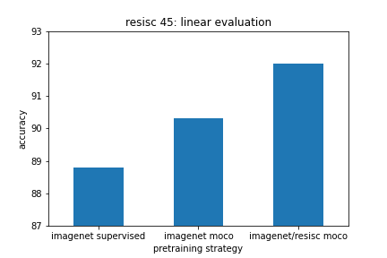

# Self-supervised Learning using VISSL

This contains a Docker image with [VISSL](https://github.com/facebookresearch/vissl) installed, a wrapper script for running VISSL on AWS Batch, and some VISSL configuration files. We have used it to train a model using self-supervised learning on the [RESISC-45](https://arxiv.org/abs/1703.00121) satellite imagery classification dataset. To train the model we use [MoCoV2](https://arxiv.org/abs/1911.05722), and [hierarchical pretraining](https://arxiv.org/abs/2103.12718). To evaluate the learned features, we froze the backbone and trained a linear classifier head using the labels. From this we can see there is an advantage in using SSL over the usual ImageNet supervised pretrained model, as well as an ImageNet MoCo pretrained model.



## Usage

*Note: this is a work in progress and many of the constants below won't work if you are not me.*

The following assumes you are in the Docker container. It can be built with `./docker/build` and then run with `./docker/run`. If you are using Batch to run experiments via the `--aws-batch` flag, set the following environment variables.

```
export JOB_DEF="lfishgoldVisslExperimentsGpuJobDefinition"
export JOB_QUEUE="lfishgoldRasterVisionGpuJobQueue"
```

To train a MoCo model on the training split of RESISC-45 using an ImageNet model as a starting point, run the following:

```
python -m vissl_experiments.vissl_wrapper \
    --aws-batch \
    --config resisc_moco \
    --output-uri s3://research-lf-dev/ssl/vissl/test-output/06-03-2021a/ \
    --dataset-uri s3://research-lf-dev/ssl/vissl/datasets/resisc45-split.zip \
    --pretrained-uri s3://research-lf-dev/ssl/vissl/checkpoints/moco.torch
```

To take the backbone of the MoCo model trained above, freeze it, add a linear classification head, and then train it on RESISC-45, run the following. This should result in a validation accuracy of 91.9%.

```
python -m vissl_experiments.vissl_wrapper \
    --aws-batch \
    --config resisc_moco_linear \
    --output-uri s3://research-lf-dev/ssl/vissl/test-output/06-03-2021b \
    --dataset-uri s3://research-lf-dev/ssl/vissl/datasets/resisc45-split.zip \
    --pretrained-uri s3://research-lf-dev/ssl/vissl/test-output/06-03-2021a/checkpoint.torch
```
